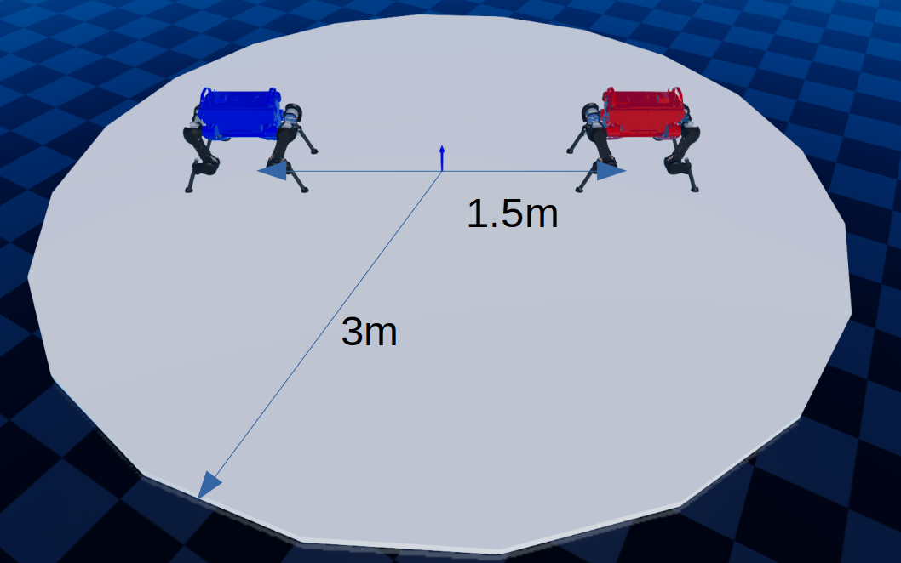
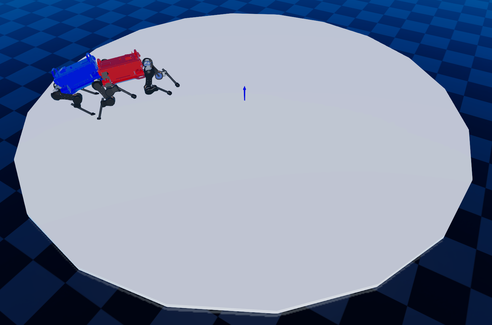
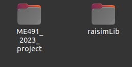
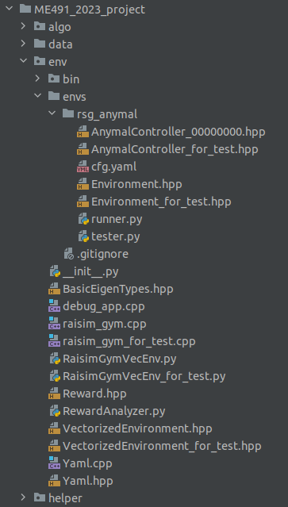
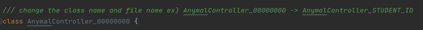
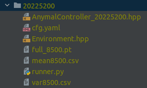
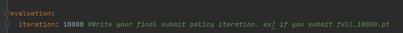

PROJECT RULE
======

Project Overview
-----

Project Objective
-----
The goal of this project is to train an agent that can **knock over opposing robots or push them out of the circle**. Students will compete against each other and be evaluated.

The arena sizes are indicated in the figure and the robots are initialized in the nominal configuration.

You can refer RaiSim document website: [raisim_website](http://raisim.com/index.html).

For your convenience, a basic template for the project is provided in the git repository (final project branch). [git_repo](https://github.com/railabatkaist/2023_ME491).

For evaluation, you need to **submit the file explained 'Submission' section**.

Project Instruction
-----
1. ### Setting workspace as below figure.

2. ### Other environment setting explained at README.md

3. ### The project file consists as below. It`s similar with RaisimGymTorch code. But you do not modify "*_for_test.*" code. These codes are for testing.

4. ### Change the file name and class name of the AnymalController_00000000.hpp file shown in the figure below to your student ID.

5. ### Once training is complete, run the tester.py code to verify the learned policy before submit. The tester.py code fights with the opponent standing with PD control. In evaluation, the opponent will be another student.

Project Rule
-----
1. ### You can use any information given by the RaiSim engine.
2. ### You cannot modify the dynamics (do not modify the URDF file, do not change control_dt=0.01, simulation_dt=0.0025 at cfg.yaml file as we give). Everyone should play in the same environment. 
3. ### Use only MLP structure for policy network.
4. ### If you have any question, please upload issues on [git_repo](https://github.com/railabatkaist/2023_ME491). (We do not allow others)
5. ### Each student will compete against each other 10 times. Each win is worth 3 points, a draw is 1 point, and a loss is 0 points. If the base touches the ground first or the robot base goes out of the circle, you will lose. See Environment_for_test.hpp code at isTerminalState() function. Details regarding points and number of matches may be subject to change.

Project Tips
-----
1. When learning, if you create an opponent robot and need information about the opponent robot's state, please refer to Environment_for_test.hpp and AnymalController_for_test.hpp codes. (We strongly recommend)

2. Use self-playing for training. For example, during the training, you learn by setting your previous policy to the opponent. Because you are fight with other student.

Submission
------
The submission code is shown in the below figure. In the cfg.yaml file, match the evaluation iteration to the policy to be submitted. Other details such as the report will be provided later.

| Submission       | Date                                           |
|------------------|------------------------------------------------|
| Report, code submission  | 2 days before the competition (Dec 11th 23:59) |

Competition

-----

We will watch the videos together on Dec 13th at 1pm.

Report

-----

Final report should contain these contents:

1. Problem definition (describe the MDP)

2. What algorithms did you use? How do they work (i.e., theory)?

3. Results. What contributed to the final performance the most?

The final report should not be more than 4 pages